<div align="center">
  <a href="https://github.com/CausalCore">
    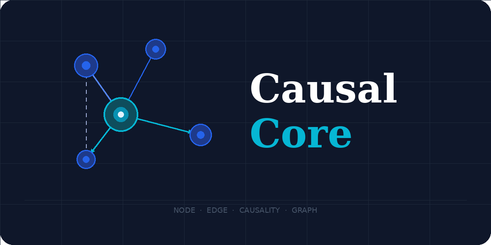
  </a>
  
  # 🟢 CausalCore
  
  **The Ultimate macOS Behavioral Causality Intelligence Engine**<br>
  <i>An open-source initiative by the <a href="https://github.com/CausalCore">CausalCore Organization</a></i>
</div>

CausalCore goes beyond simple system monitors. It doesn't just show you that your CPU is at 100%; it tells you *why* your system feels slow by calculating temporal causality, tracking baseline deviations, and understanding macOS internals (like WindowServer UI lag and Swap Thrashing).

## 🚀 Features

- **⚡ God Mode Controls**: `autostart`, `uninstall`, `free-ram`, and `nuke` for ultimate system domination.
- **🤖 Local AI Chat (`causalcore chat`)**: Talk to an offline LLM (Ollama) about your Mac's health.
- **🔒 Privacy Sentinel (`causalcore network`)**: Catch apps opening suspicious network connections.
- **🖥️ Desktop Widget (`causalcore widget`)**: A minimalist HUD for your desktop.
- **🧠 Causality Engine (DAG)**: Finds the real root cause of system lag.
- **🔋 Battery Drain Detector**: Uncovers apps secretly destroying your battery.
- **🎯 Focus Mode**: Instantly pauses iCloud, Spotlight, and TimeMachine.
- **🧹 Storage Bloat Finder**: Finds gigabytes of hidden developer caches.
- **🌡️ Thermal Throttling Tracking**: Knows when your CPU is secretly underclocking.
- **📊 Live Hacker TUI**: A beautiful terminal dashboard (`causalcore dashboard`).
- **📸 Gamification**: Share your Mac's Health Score ASCII art! (`causalcore share`).

## 📦 Installation

### Option 1: Homebrew (Recommended)
You can easily install CausalCore via our official Homebrew tap:

```bash
brew tap CausalCore/mac-perf-monitor https://github.com/CausalCore/mac-perf-monitor
brew install causalcore
```

### Option 2: From Source
```bash
git clone https://github.com/CausalCore/mac-perf-monitor.git
cd mac-perf-monitor
python3 -m venv venv
source venv/bin/activate
pip install -e .
```

## 🛠 Command Reference

### 🔍 Diagnostics & UI
- `causalcore analyze` : Run the full causality engine and print the root-cause DAG.
- `causalcore dashboard` : Launch the interactive live Terminal UI (TUI).
- `causalcore tray` : Start the minimalist macOS Menu Bar app.
- `causalcore report` : Generate a weekly HTML system health report to your desktop.
- `causalcore share` : Export a Spotify Wrapped-style ASCII health score to share on social media.

### ⚡ Optimizations (Mass Market)
- `causalcore boost` : Show the safe action plan for current bottlenecks (`--plan` and `--apply`).
- `causalcore battery` : Detect processes secretly destroying your battery life.
- `causalcore focus` : Pause background bloat (iCloud, Spotlight, TimeMachine) for gaming/rendering.
- `causalcore unfocus` : Restore background services.
- `causalcore clean` : Find hidden storage bloat (Xcode, npm, Caches).

### 🤖 Smart & Privacy
- `causalcore chat "question"` : Ask the Local AI (Ollama) about your system's health.
- `causalcore network` : Catch apps opening suspicious background connections.

### 🔥 God Mode (System Admin)
- `causalcore autostart` : Interrogate and disable macOS startup bloat (LaunchAgents).
- `causalcore uninstall <app>` : Deep clean all hidden leftovers (`Application Support`, `Caches`) of an app.
- `causalcore free-ram` : Physically purge RAM disk caches instantly (`sudo purge`).
- `causalcore nuke` : Evaporate all forgotten Docker containers, volumes, and images.

## 📸 Feature Gallery

| 🔍 Causality Diagnostics (`analyze`) | ⚡ Safe Optimizations (`boost`) |
| :---: | :---: |
| 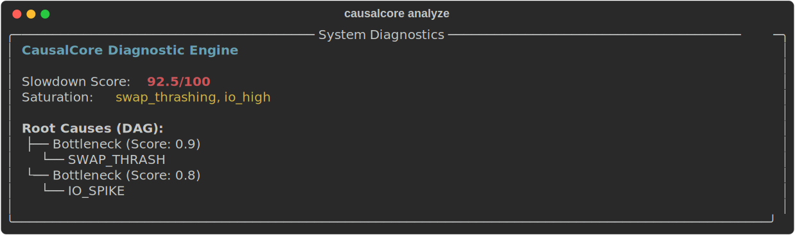 | 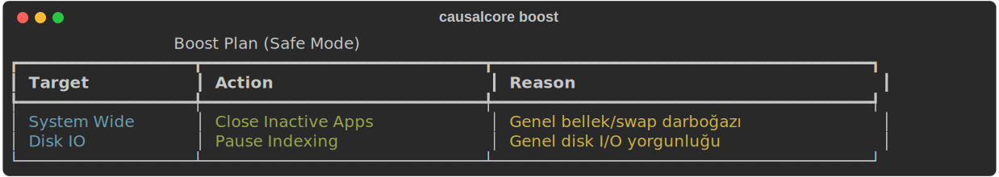 |

| 📊 Live Hacker Dashboard (`dashboard`) | 📌 Menu Bar App (`tray`) |
| :---: | :---: |
| 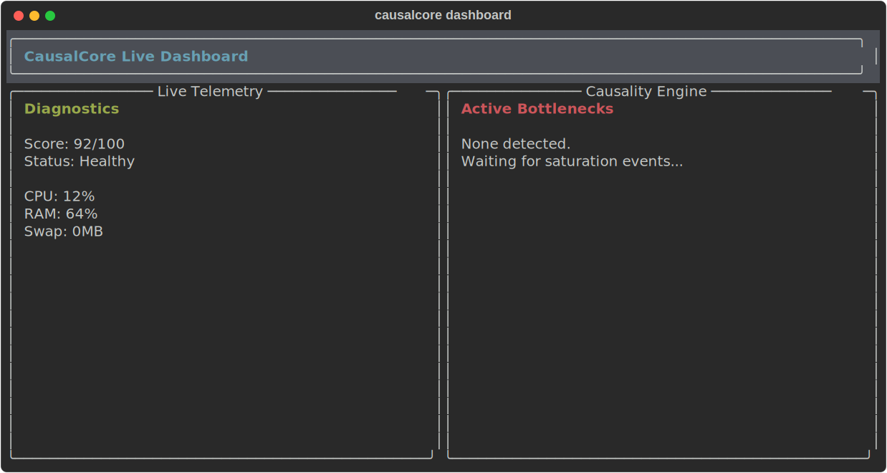 | 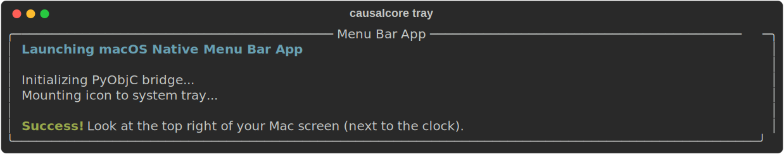 |

| 🔋 Battery Drain Detector (`battery`) | 🧹 Storage Bloat Scanner (`clean`) |
| :---: | :---: |
| 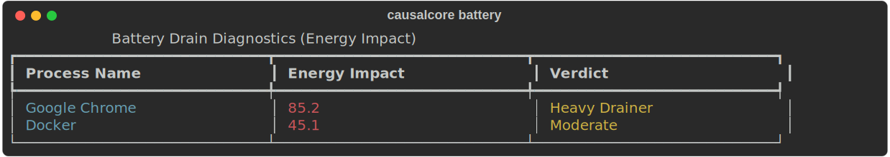 | 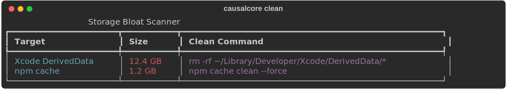 |

| 🎯 Focus Mode (`focus`) | 🤖 Local AI Chat (`chat`) |
| :---: | :---: |
| 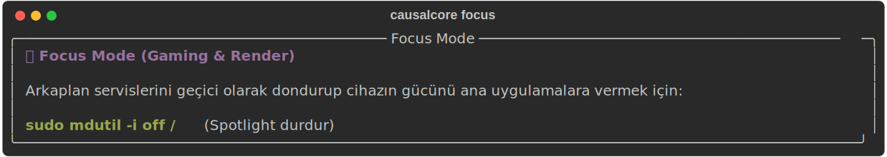 | 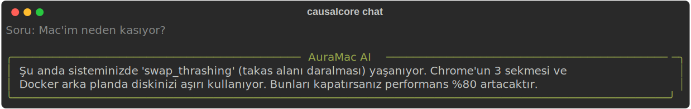 |

| 🔒 Network Sentinel (`network`) | 📸 Gamification (`share`) |
| :---: | :---: |
| 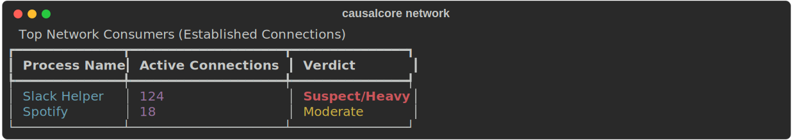 | 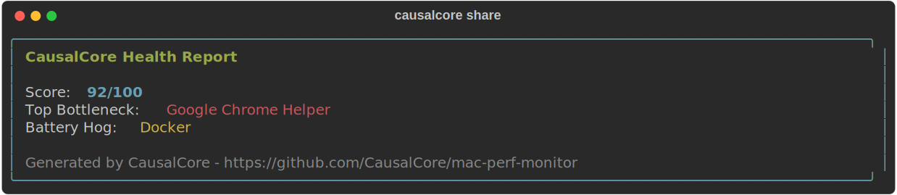 |

| 🔥 God Mode: AppCleaner (`uninstall`) | 🔥 God Mode: Autostart (`autostart`) |
| :---: | :---: |
| 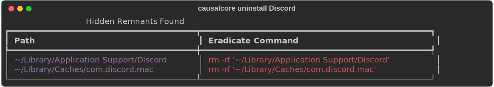 | 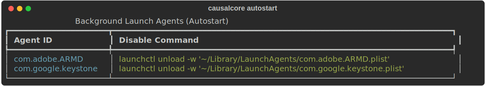 |

| 🔥 God Mode: Docker Nuke (`nuke`) | 🧠 Free RAM (`free-ram`) |
| :---: | :---: |
| 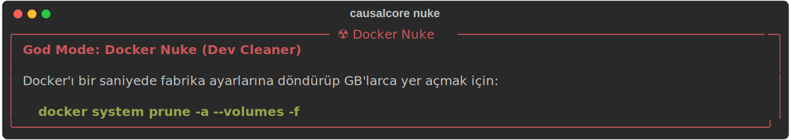 | 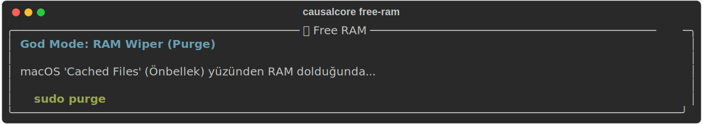 |

| 📈 HTML Report Generator (`report`) | |
| :---: | :---: |
| 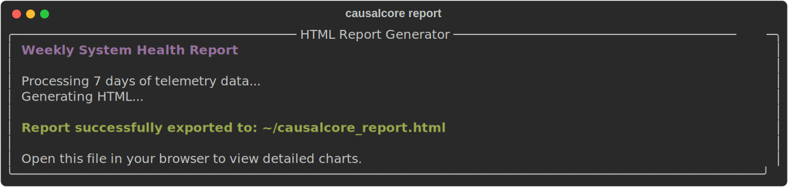 | |

## 💡 Pro Tips & Real-World Usage

### 🖥️ Transparent Desktop Widget (`causalcore widget`)
This is not a standard macOS widget; it's a **"Hacker Style" Terminal Widget**.
1. Open your terminal (e.g., iTerm2) and run `causalcore widget`.
2. Go to your terminal settings and set the background to **Transparent** and hide the **Title Bar**.
3. Pin the window to your desktop. You now have a cyberpunk-style live system monitor glued to your wallpaper!

### 📌 macOS Menu Bar Integration (`causalcore tray`)
Run `causalcore tray` in your terminal. This triggers a **Native macOS Menu Bar App** (next to your clock/wifi). You can monitor your RAM, thermal levels, and click to instantly run causality diagnostics without ever opening the terminal again!

### 🎯 Gaming & Rendering: Focus Mode (`causalcore focus`)
When you are about to launch a heavy game or start a 4K video render, run `causalcore focus`. It temporarily freezes background Apple sync services (iCloud, Spotlight indexing, TimeMachine) to give 100% of your CPU to your foreground task. Run `causalcore unfocus` when you're done.

### 🤖 Local AI Chat (`causalcore chat`)
Why Google your Mac's problems when you can ask it directly? By running `causalcore chat "Why is my Mac slow?"`, the engine feeds its real-time DAG diagnostics into a local offline LLM (Ollama). You get human-like tech support without sending a single byte of your system data to the cloud.

### 🔒 Privacy Sentinel (`causalcore network`)
Perfect for catching sneaky background apps. It scans all established connections and flags suspicious network hogs (like that random Helper process sending gigabytes of telemetry).

### 🔥 God Mode: App Dev Nuke (`causalcore nuke` & `clean`)
- Run `causalcore clean` to find gigabytes of hidden `Xcode DerivedData`, `npm cache`, and `yarn` bloat that standard Mac cleaners miss.
- Run `causalcore nuke` if you are a developer. It will instantly execute a full `docker system prune` and wipe all forgotten Docker containers and dangling volumes, freeing up massive disk space in one second.

### 🧹 Deep Eradication (`causalcore uninstall` & `autostart`)
- **AppCleaner Alternative:** Run `causalcore uninstall <App>` to hunt down and destroy all hidden `~/Library/Application Support` and `Caches` related to an app.
- **Boot Optimizer:** Run `causalcore autostart` to interrogate hidden `LaunchAgents` and disable apps that secretly start up with your Mac.

## 🧠 How the Engine Works
CausalCore builds a **Directed Acyclic Graph (DAG)** of your system. It links hardware saturations (e.g., IO Spikes, Swap Thrashing) to the responsible processes using a **Decay Curve**. It also learns your usage patterns to create a Multi-Baseline, ensuring it doesn't give you false positives just because you opened a heavy IDE.

---

<div align="center">
  <b>Developed with ❤️ for macOS by <a href="https://github.com/k0d1r">k0d1r</a></b><br>
  <b>Backed by the <a href="https://github.com/CausalCore">CausalCore Organization</a></b><br>
  <i>Built with Python, Rich, and a deep love for macOS internal engineering.</i>
</div>
